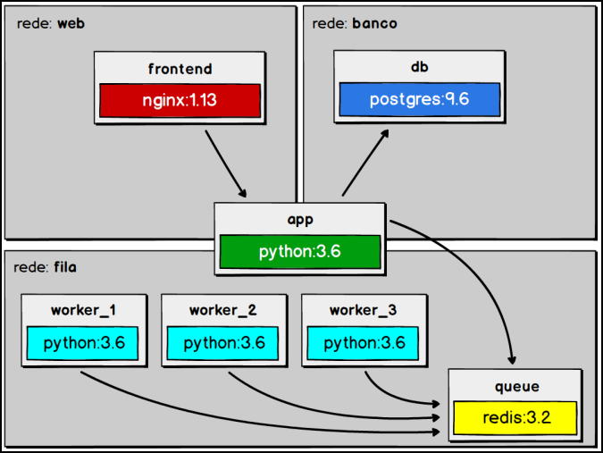

# ESTUDOS DOCKER

Exemplo completo de uma aplicação com múltiplos serviços em docker

## Componentes
- Servidor web
- Banco de dados
- Gerenciamento de filas
- Workers para envio de e-mail (escalável)
- Aplicação principal

## Comandos uteis
- docker-compose up -d (subir aplicaçõees)
- docker-compose up -d --scale worker=3 (subir aplicaçõees s criando 3 instancias do serviço worker)
- docker-compose ps (listar os containers)
- docker-compose down (parar as aplicações)
- docker-compose logs -f -t
- docker-compose exec db psql -U postgres -d email_sender -c 'select * from emails'

## Diagrama do projeto

